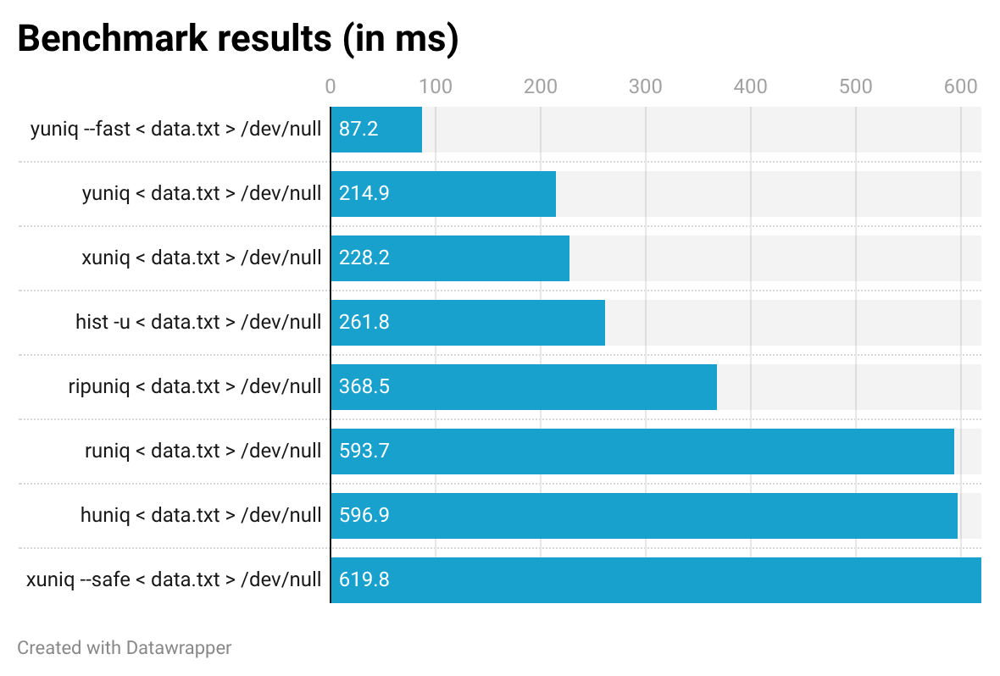

# yuniq: hyperfast line deduplicator

`yuniq` is a high-performance and stable line deduplicator.

Unlike the standard `uniq` utility, `yuniq` does not require your input to be sorted.

## Usage

```
Hyperfast line deduplicator

Usage: yuniq [OPTIONS]

Options:
      --size-hint <SIZE_HINT>      Expected number of unique lines (used to pre-size internal structures) [default: 1048576]
      --fast                       Use 64-bit hashing (faster, negligible collision risk)
      --safe                       Store exact line bytes for collision-free deduplication (slower)
  -c, --count                      Prefix each line with its global occurrence count
  -w, --check-chars <CHECK_CHARS>  Only compare the first N characters of each line
  -s, --skip-chars <SKIP_CHARS>    Skip the first N characters of each line before comparing
  -f, --skip-fields <SKIP_FIELDS>  Skip the first N whitespace-delimited fields of each line before comparing
  -h, --help                       Print help
```

## Benchmarks



| Command                                                                 |      Mean [ms] | Min [ms] | Max [ms] |    Relative |
| :---------------------------------------------------------------------- | -------------: | -------: | -------: | ----------: |
| `./target/release/yuniq --fast < data.txt > /dev/null`                  |   101.9 ± 5.0  |     94.2 |    111.9 |        1.00 |
| `./target/release/yuniq < data.txt > /dev/null`                         |   147.4 ± 3.4  |    142.3 |    154.1 | 1.45 ± 0.08 |
| `xuniq < data.txt > /dev/null`                                          |   230.1 ± 6.3  |    221.0 |    243.6 | 2.26 ± 0.13 |
| `./target/release/yuniq --safe < data.txt > /dev/null`                  |   252.2 ± 5.2  |    246.7 |    264.5 | 2.48 ± 0.13 |
| `hist < data.txt > /dev/null`                                           |   304.7 ± 4.9  |    295.6 |    313.8 | 2.99 ± 0.15 |
| `ripuniq < data.txt > /dev/null`                                        |   385.5 ± 9.9  |    371.5 |    400.6 | 3.79 ± 0.21 |
| `runiq < data.txt > /dev/null`                                          |   597.7 ± 10.9 |    586.8 |    621.8 | 5.87 ± 0.30 |
| `huniq < data.txt > /dev/null`                                          |   607.9 ± 5.4  |    596.8 |    618.1 | 5.97 ± 0.30 |
| `perl -ne 'print if !$seen{$_}++' data.txt > /dev/null`                 | 1820.5 ± 49.5  |   1784.3 |   1944.4 | 17.87 ± 1.00 |
| `awk '!seen[$0]++' data.txt > /dev/null`                                | 3769.5 ± 57.2  |   3709.9 |   3856.9 | 37.01 ± 1.89 |
| `sort -u data.txt > /dev/null`                                          | 7013.2 ± 54.3  |   6972.3 |   7160.1 | 68.86 ± 3.39 |
| `sort data.txt \| uniq > /dev/null`                                     | 7595.8 ± 72.8  |   7527.7 |   7781.9 | 74.58 ± 3.70 |

### Commands to reproduce

```bash
{
  seq 1 1250000 | awk '{print "dup_"$1; print "dup_"$1}'; # Duplicated lines
  seq 1250001 3750000 | awk '{print "uniq_"$1}';          # Unique lines
} | shuf > data.txt

hyperfine --warmup 3 \
  './target/release/yuniq --fast < data.txt > /dev/null' \
  './target/release/yuniq < data.txt > /dev/null' \
  'xuniq < data.txt > /dev/null' \
  './target/release/yuniq --safe < data.txt > /dev/null' \
  'hist < data.txt > /dev/null' \
  'ripuniq < data.txt > /dev/null' \
  'runiq < data.txt > /dev/null' \
  'huniq < data.txt > /dev/null' \
  'perl -ne '\''print if !$seen{$_}++'\'' data.txt > /dev/null' \
  'awk '\''!seen[$0]++'\'' data.txt > /dev/null' \
  'sort -u data.txt > /dev/null' \
  'sort data.txt | uniq > /dev/null' \
  --export-markdown bench.md
```
